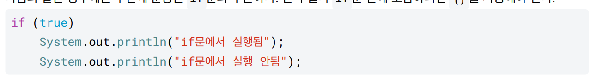

# 조건문

if문: 조건이 참인지 확인하고, 조건이 참일 경우 특정 코드 블록을 실행

else: if문에서 만족하는 조건이 없을 때 실행하는 코드를 제공 

else if: if문의 조건이 거짓일 때 다음 조건을 검사, if문이 참이면 else if 실행X

if문 다음에 실행할 명령이 하나만 있을 경우에는 {}중괄호 생략 가능

else if, else도 마찬가지!!!!!

if문의 명령이 한개만 있을 경우 중괄호를 사용하는 것이 좋다.

- 가독성: 코드의 흐름을 더 쉽게 이해할 수 있음
- 유지보수성: 코드를 수정할 때 오류를 덜 발생시킬 수 있다

## switch

if문을 조금 더 편리하게 사용할 수 있는 기능

if문은 연산자를 사용할 수 있지만, switch문은 단순히 값이 같은지만 비교할 수 있다.

break문 : 
반복문 (`for`, `while`)을 중간에 종료할 때 사용됩니다. 반복문 내에서 특정 조건이 만족되면 더 이상 반복을 하지 않고 빠져나오게 됨

ex)

for i in range(10):
if i == 5:
break  # i가 5일 때 반복문을 종료
print(i)

## 삼항 연산자

if문을 사용할 대 다음과 같이 단순히 참과 거짓에 따라 특정 값을 구하는 경우가 있다.

항이 3개(조건, 참_표현식, 거짓_표현식

특정 조건에 따라 결과가 나오기 때문에 조건 연산자라고 한다

단순한 표현식만 넣을 수 있다