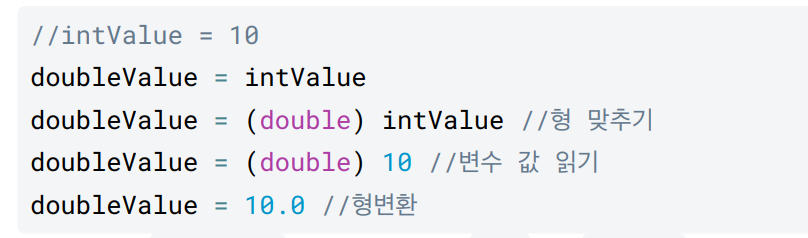

# 스코프, 형변환

스코프1-지역 변수와 스코프

변수는 선언한 위치에 따라 지역변수, 멤버 변수로 분류

지역 변수:  특정 지역에서만 사용할 수 있는 변수, 그 특정 지역을 벗어나면 사용 못 함

스코프2-스코프 존재 이유

- 비효율적인 메모리 사용 —> 효율적인 메모리를 사용할 수 있다.
- 코드 복잡성 증가—> 코드를 간단화 할 수 있다.

while문 vs for문 - 스코프 관점

while : i의 스코프가 main() 메서드 전체가 된다.

for : i의 스코프가 for문 안으로 한정된다.

따라서 while문 보다는 for문을 사용해서 스코프의 범위를 제한하는 것이 메모리 사용과 유지보수 관점에서 더 좋다.

---

정리
-변수는 꼭 필요한 범위로 한정해서 사용하는 것이 좋다. 변수의 스코프는 꼭 필요한 곳으로 한정해서 사용하자 

-메모리를 효율적으로 사용하고 더 유지보수하기 좋은 코드를 만들 수 있다.
좋은 프로그램은 무한한 자유가 있는 프로그램이 아니라 적절한 제약이 있는 프로그램이다.

# 형변환1 - 자동 형변환

형변환

-작은 범위에서 큰 범위로는 당연히 값을 넣을 수 있다.

ex) int→ long→ double

-큰 범위에서 작은 범위는 다음과 같은 문제가 발생할 수 있다.

- 소수점 버림
- 오버플로우

하지만 결국 대입하는 형(타입)을 맞추어야 함

작은 범위 숫자 타입에서 큰 범위 숫자 타입으로의 대입은 개발자가 이렇게 직접 형변환을 하지 않아도 된다. 

이런 과정이 자동으로 일어나기 때문에 자동 형변환, 또는 묵시적 형변환이라 한다.

# 형변환2 - 명시적 형변환

큰 범위에서 작은 범위 대입

double 은 실수를 표현할 수 있다. 따라서 1.5 가 가능하다. 그런데 int 는 실수를 표현할 수 없다

자바에서 계산은 다음 2가지를 기억

1. 같은 타입끼리의 계산은 같은 타입의 결과를 낸다.
-int + int 는 int 를, double + double 은 double 의 결과가 나온다.
2. 서로 다른 타입의 계산은 큰 범위로 자동 형변환이 일어난다.
-int + long 은 long + long 으로 자동 형변환이 일어난다.
-int + double 은 double + double 로 자동 형변환이 일어난다

---

정리
형변환
int—> long—> double
-작은 범위에서 큰 범위로는 대입할 수 있다.
      -이것을 묵시적 형변환 또는 자동 형변환이라 한다.
-큰 범위에서 작은 범위의 대입은 다음과 같은 문제가 발생할 수 있다. 이때는 명시적 형변환을 사용해야 한다.
       -소수점 버림
        -오버플로우
-연산과 형변환
         -같은 타입은 같은 결과를 낸다.
          -서로 다른 타입의 계산은 큰 범위로 자동 형변환이 일어난다.